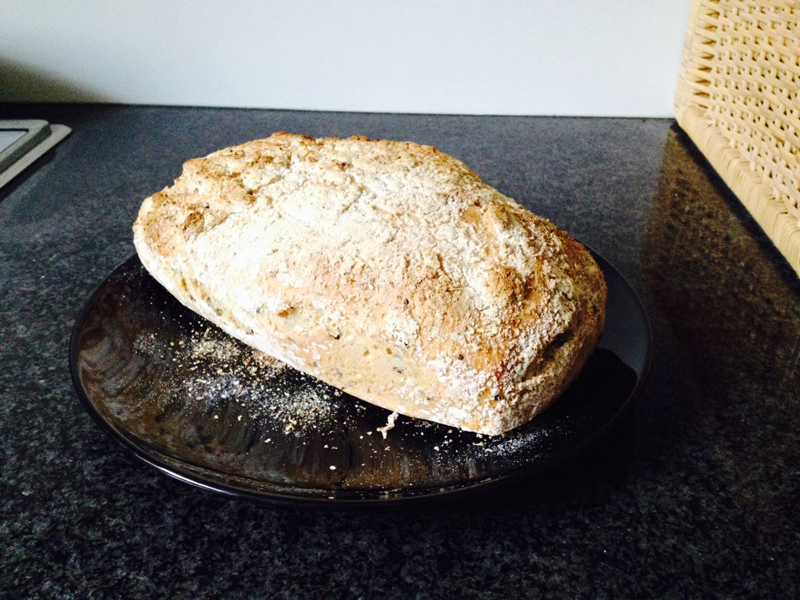
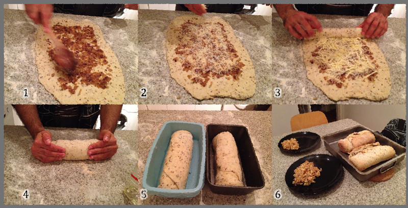

# Pao roots (2 breads; vegan, soy free, contains gluten)  
  
## Ingredients  
* 600 g of white flour;  
* 400 g of wholemeal flour;  
* Fiber mix (2 tbsp of hemp flour, 1 tbsp of chia seeds, 1 tbsp of linseed, 1 tbsp of quickminute oats);  
* 2 cups of raw nut mix (pepitas, sunflower seeds, cashew nuts and almonds);  
* 3 bags (7g each) of dried yeast;  
* 800 ml of warm (not very hot) water;  
* 2 tbsp of salt.  

## How to prepare  
In a bowl, mix the flours, fiber mix, water, yeast and salt. Cover with a plastic wrap and let it ferment for up to 18 hours (the longer the better beery taste). In another bowl, soak the nut mix. After 18h, drain the nut mix and rinse it. Sprinkle some flour on the table and throw the dough (very wet indeed, don’t worry). Sprinkle flour and some of the nut mix on top and fold it. Repeat this process ten times. Put this dough on an oven tray, cover it with a dish cloth and let it rest for 2 hours. After 2 hours, grease a metal bread tray in put it in the oven (250oC) until it starts sparkling (yes, it needs to be very very hot). Take it out, and put half of the dough in it. Don’t worry about the shape, it will get even while cooking. Bake it for 45 min at 250oC. Do the same for the second half of the dough.

  

# Larica Banana bread (vegan, soy-free, contains gluten)  
  
## Ingredients  
* 1 cup of oat fiber (from the oat milk);  
* 1 to 11/2 cup of whole meal flour;  
* 1 tbsp of vanilla extract;  
* 2 very ripe bananas, mashed;  
* 2 tbsp of panela sugar;  
* 1 and 1/2 tbsp of extra virgin coconut oil;  
* 1/2  cup of raw almonds, processed in a blender (small pieces);  
* 1/2  cup of raw macadamia and/or cashew nuts, processed in a blender (small pieces);  
* 2 tbsp of baking powder.  

## How to prepare  
Mix all the ingredients (save the baking powder for the last mix) and bake at 200˚C for 20-25 min. Be happy!  

  

# Onion and Parmesan cheese bread (vegetarian)  

## Ingredients  
**Dough**  
* 3/4 kg of self-raising white flour;  
* 1/4 kg of wholemeal flour;  
* 2 cups of warm (not hot) whole milk;  
* 1/4 of cup of olive oil;  
* 2 bags (7g each) of dried yeast;  
* Salt and pepper to taste.  

**Filling**  
* 250g of parmesan cheese;  
* 1 big onion (diced);  
* 2 tbsp of soy sauce;  

## How to prepare  
In a bowl, gently mix the milk, olive oil, yeast, salt and pepper and a little bit of flour. Slowly pour in more flour, always hand mixing it until desired consistency is achieved (ideally, it will no longer stick to your hands). Let the dough rest for 15 minutes. On a stir fry pan, stir fry the onion with olive oil and soy sauce, and set it aside. Split the dough into 2, evenly spread the dough on a clean surface, using either your hands or a rolling pin. Spread half of the fried onions on top of it (photo strip 1) and sprinkle parmesan chesse on it - make sure you leave enough empty border to avoid the filling ti leak (photo strip 2). Roll the dough (photo strip 3) and make sure you tuck the side borders in (photo strip 4). Repeat the steps with the other half of the dough (photo strip 5). Pre-heat the oven at ~200˚C. Bake it for ~20 minutes. Serves 8 people (photo strip 6).  

  