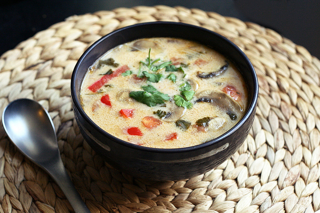

# Tom Kha Gai (*Thai coconut soup* -- enough for 3 people; vegan, gluten-free, contains soy from tofu and soy sauce)  

## Ingredients  
* 1 L of vegetable stock (generally a mix of 500 ml liquid stock + 500 ml water);  
* 500 ml can full-fat coconut cream;  
* 1 stalk lemongrass (capim-limão; press stalk first), cut into 1-inch pieces and pounded to really release the flavors;  
* 6 kaffir lime (combava) leaves (torn);  
* 6 thin slices fresh galangal (galanga) root (or ginger);  
* 1 cup mushrooms chopped in quarters;  
* 1 small red capsicum, thinly sliced;  
* 1/2 medium red (or white) onion, thinly sliced;  
* 3 tablespoons soy sauce;  
* 2.5 tablespoons fresh lime juice;  
* 2 birds-eye chilies (strong), finely chopped;  
* 1 long red chilies (mild), roughly chopped;  
* 1 cup firm tofu, diced;  
* 1 tomato, diced;  
* 1 small bunch of broccoli (small florets);  
* 2 medium carrots sliced;  
* 1/2 cup of baby corn;  
* 1/2 cup of wombok (Chinese cabbage) or buk choy finely chopped;  
* 1/4 cup coriander, roughly chopped;  
* 1/4 cup thai basil, roughly chopped (optional);  

## How to prepare  
Bring the vegetable stock to a boil in a large saucepan over a medium-high heat, add in the coconut milk, lemongrass, kaffir lime leaves, galangal, mushrooms, capsicum, onion, soy sauce, lime juice, chili and tofu. Simmer for 10 minutes, then add all remaining vegetables and simmer for another 5 min. Just before serving add in the thai basil and coriander. Ladle into bowls and serve immediately, topped with additional chopped coriander, thai basil and maybe some thinly sliced green onions.  

  
[Photo credit -- BETH @ TASTY YUMMIES](http://tasty-yummies.com/2012/05/02/tom-kha-gai-soup-thai-coconut-soup-gluten-free-dairy-free-wvegan-options/)  
